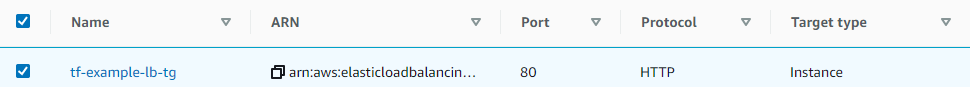

# AWS Terraform Task


### Requierments :
We'll create a Terraform code that produces the following AWS resources:
(In the default VPC)
- 2 Instances (t2.micro) - with NGINX running on each
- An Application Load Balancer that forwards the users’ traffic to the servers


_______________________________________________

## Terraform code:

### Before starting : 

- #### You need to donwload Terraform on your computer: 
 
  follow the instructions in link: https://www.terraform.io/downloads.html 
  Install Terraform by unzipping it and moving it to a directory and include it in your system's PATH .
  
- #### Create an AWS access key:

  - Create an IAM user, and then define that user's permissions as narrowly as possible.
  - Create the access key under that IAM user.

_______________________________________________


### Let's start: 

- #### After creating AWS access key and secret, add them to the code:
  ```
  provider "aws" {
  region = "eu-west-1"
  access_key = "Your access key here" 
  secret_key = "Your secret key here"
  }
  ```
- #### Create Security Group (SG), to allow inbound web traffic:

  

- #### create the instances :

  - create two instances : (by setting the count value = 2 in the resource "aws_instance" "web") 

  - create install_nginx.sh file and write in it the script for installing nginx in the instances ,  use the file in user_data attribute to install the NGINX upon creation
    
      ```
      user_data = "${file("install_nginx.sh")}"
      ```
   - Add tag name to the instances : ("webserver-1" & "webserver-2")
    
      ```
      Name = "webserver-${count.index + 1}"
      ```
    
    
    
- #### create target group & attach instances to target group:
  - target group : (named : tf-example-lb-tg , and in the same default VPC)
    
  - instances attached to target group  (status "Unused"): 
    
  
- #### create Application load balancer &  listener :
  - ALB named :"test-lb-tf" 
  
    
  
  - add listener to ALB and set the action to forward to the target group we've created :
  
    (The targets status will change to healthy ,after health check)
    
    


_______________________________________________

### Run Terraform code:

- #### Initialize terraform : open the terminal and run the following command

   ```
    terraform init
   ```
- #### Before applying , preview code results:

   run the following command

   ```
    terraform plan
   ```
  The terraform plan command creates an execution plan with a preview of the changes that Terraform will make to your infrastructure.
  
- #### run the code by the command:
  
   ```
    terraform apply
   ```
 
 - #### Go to AWS LoadBalancer & you'll see the created ALB , copy DNS address and paste it on browser , this is what you'll see :
 
   

   
  
  
